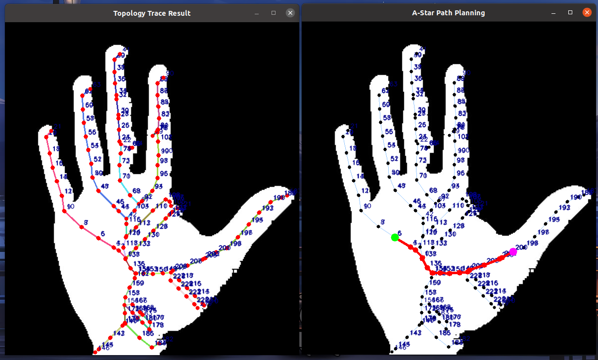
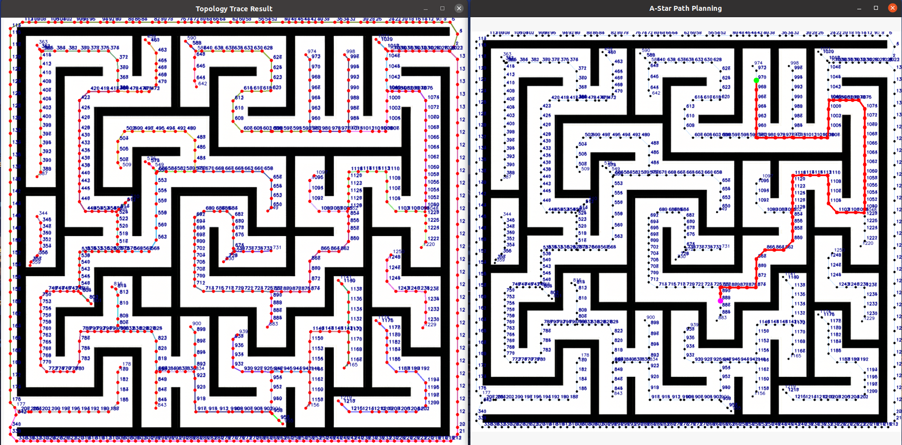
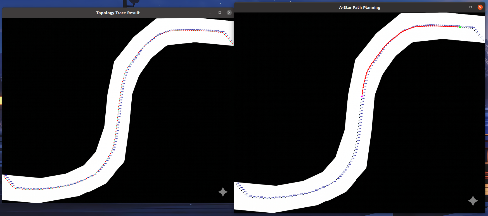
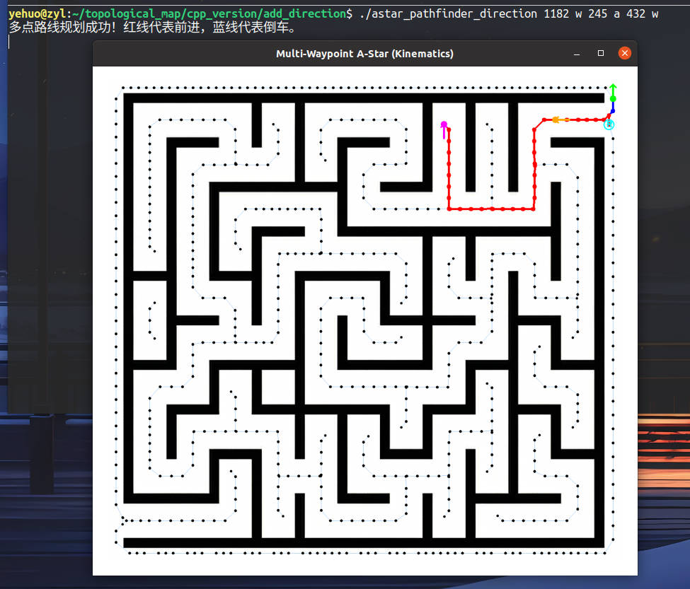
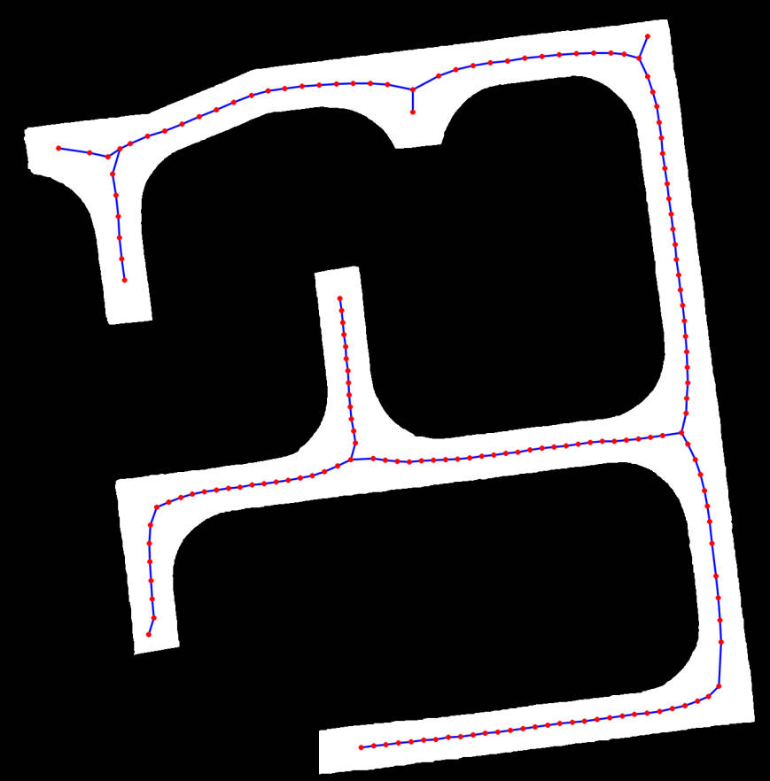
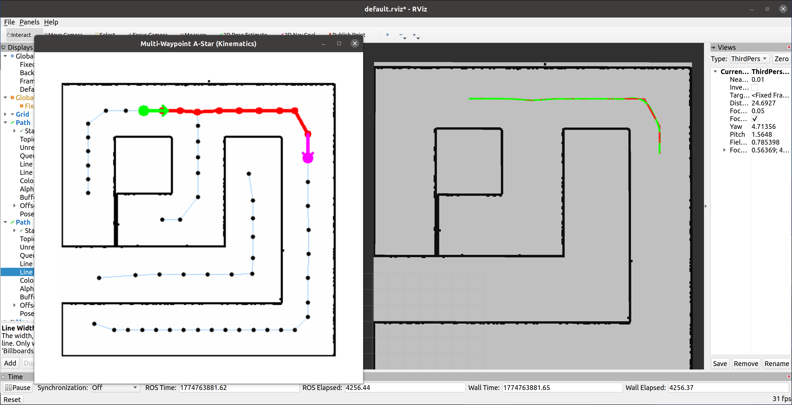
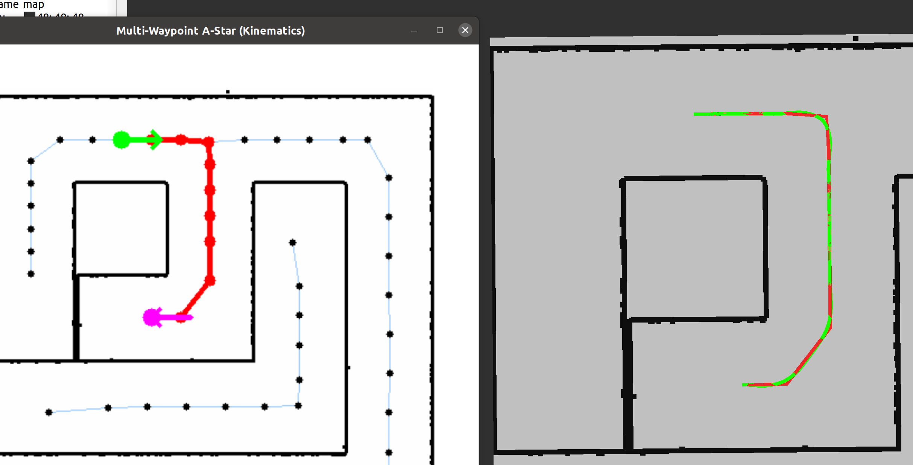
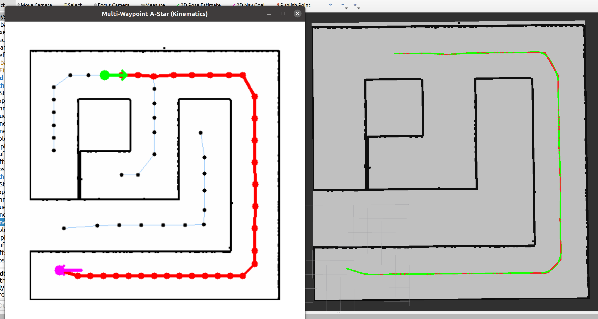

# 工具描述
> 基于项目[skeleton-tracing](https://github.com/LingDong-/skeleton-tracing)基础上实现

> 主要用于将已有的“二值化”图片自动构建一张拓扑地图，以供A*等算法使用

> 是单纯的 python 、C++ 实现，未结合 ROS 使用

# 具体效果







# 使用步骤
## 第一步：安装依赖
### 安装 nlohmann
```bash
sudo apt install nlohmann-json3-dev

```
### 安装 opencv
## 第二步：下载项目
```bash
git clone git@github.com:zylyehuo/topological-map.git

```
## 第三步：准备所需的图片

## 第四步：根据文件路径修改源码中的相关部分

## 第五步：设置起点、终点

## 第六步：运行指令
### Python 版本
```bash
python3 ./trace_skeleton.py

```

```bash
python3 ./astar_pathfinder.py

```
### C++ 版本
#### 终点无朝向要求

```bash
g++ map_generator.cpp -o map_generator `pkg-config --cflags --libs opencv4` -O3

./map_generator

```

```bash
g++ astar_pathfinder.cpp -o astar_pathfinder `pkg-config --cflags --libs opencv4` -O3

./astar_pathfinder

```
#### 终点朝向固定

```bash
# 1. 编译基础拓扑图生成器
g++ map_generator.cpp -o map_generator `pkg-config --cflags --libs opencv4` -std=c++11

./map_generator

```

```bash
# 2. 节点预处理
g++ process_graph.cpp -o process_graph -std=c++11 `pkg-config --cflags --libs opencv4`

./process_graph

```

```bash
# 3. 编译姿态约束 A* 算法（包含起点、途经点和终点）
g++ astar_pathfinder_direction.cpp -o astar_pathfinder_direction `pkg-config --cflags --libs opencv4` -std=c++11

./astar_pathfinder_direction 1182 w 245 a 432 w

```
#### 终点朝向固定，并且基于 ROS1 noetic 结合优化库 LBFGS 使用
> [LBFGS_noetic](https://github.com/zylyehuo/LBFGS_noetic)




```bash
# 发布地图
rosrun map_server map_server /home/yehuo/topological_map/cpp_version/add_direction/8/maze.yaml

```
```bash
# 编译姿态约束 A* 算法（包含起点、途经点和终点）【ROS1 版】
g++ astar_pathfinder_direction_ros1.cpp -o astar_pathfinder_direction_ros1 \
`pkg-config --cflags --libs opencv4` \
-I/opt/ros/noetic/include \
-L/opt/ros/noetic/lib \
-lroscpp -lroscpp_serialization -lrostime -lrosconsole \
-std=c++14

./astar_pathfinder_direction_ros1 8 d 19 a

```