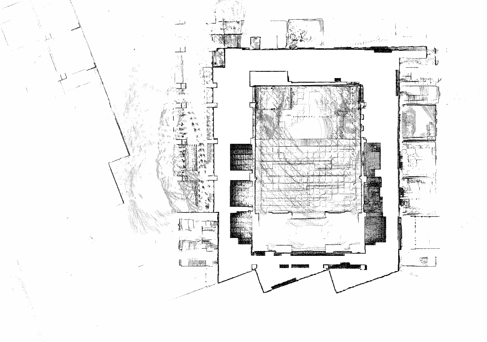
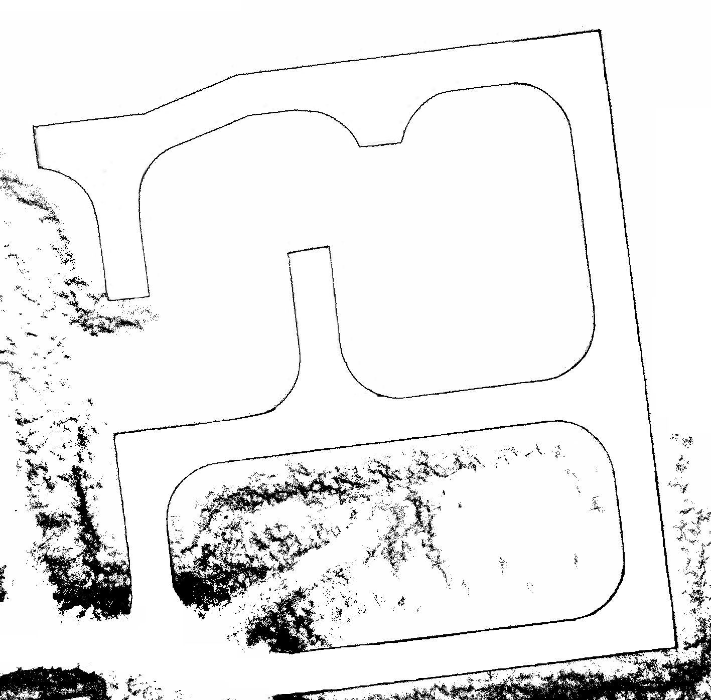

# 具体效果
## INDOOR
### 处理前


### 处理后


## ROAD
### 处理前


### 处理后


# 将需要处理的图片放在 origin 目录下

# 脚本一：图片预处理

```python
python3 ./clear_process.py

```

# 脚本二：选择边缘闭合 & 区域颜色填充

```python
python3 ./draw_process.py

```
# 脚本三：保留主要的可通行区域（白色部分只保留一块）

```python
python3 ./open_process.py

```